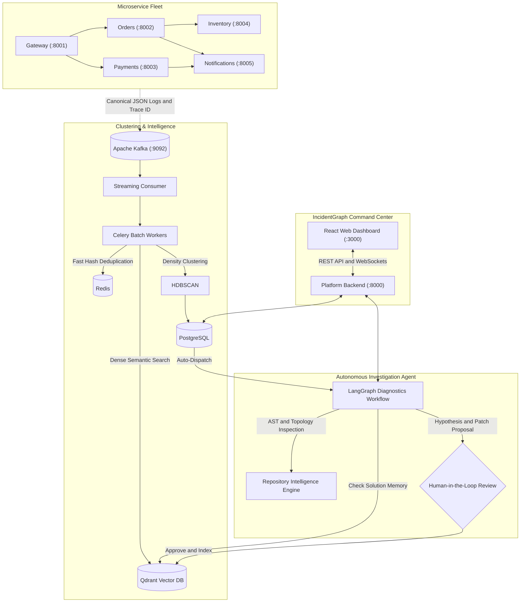

# IncidentGraph

An autonomous AI incident intelligence and remediation platform for distributed microservices. **IncidentGraph** continuously monitors distributed telemetry, clusters anomalies into causal incidents, performs autonomous root cause analysis down to exact source code lines using LangGraph, and provides an interactive SRE command center with Human-in-the-Loop decision control.

[](LICENSE)
[](docker-compose.yaml)
[](https://python.org)
[](https://fastapi.tiangolo.com)
[](https://langchain-ai.github.io/langgraph/)
[](https://docs.celeryq.dev)
[](https://kafka.apache.org)
[](https://qdrant.tech)
[](https://redis.io)
[](https://postgresql.org)
[](frontend/)
[](tests/)

---

## Architecture Overview



---

## Key Features

- **Distributed Tracing & Canonical Logging**: Outbound propagation of `x-trace-id`, `x-request-id`, and `x-session-id` across HTTP hops with structured 15-field JSON logging.
- **Asynchronous Task Queue & Batch Processing (Celery & Redis)**: High-throughput log batching and background diagnostic agent dispatch using Celery workers backed by Redis queues.
- **Streaming Incident Clustering**: Real-time Kafka consumer pairing Redis O(1) fingerprint lookups, dense semantic vector deduplication (Qdrant), and HDBSCAN density clustering.
- **Repository Intelligence & Context Engine**: Domain-agnostic AST parsing, incremental SHA256 code manifests, NetworkX dependency interaction graph, and blast radius calculation.
- **Autonomous LangGraph Diagnostic Agent**: Multi-iteration reasoning loop (Planner, Evidence Gatherer, Hypothesis Generator, and Adversarial Auditor) that inspects code down to file and line ranges.
- **Dual-Layer Solution Memory**: Reuses validated incident resolutions via Qdrant vector search for 0-token instant resolution shortcuts on recurring incidents.
- **Modern SRE Command Center**: Interactive React + Cytoscape.js dashboard with live fleet health, millisecond latency metrics, real-time WebSocket event feed, and global `Ctrl+K` search.
- **Human-in-the-Loop (HITL) Workflow**: One-click review with **Approve & Commit to Memory** and **Reject Fix** buttons, keeping operators in control.

---

## Quickstart

### 1. Prerequisites
- [Docker](https://docs.docker.com/get-docker/) & Docker Compose
- Python 3.11+ (for local scripts and virtual environment)

### 2. Environment Configuration
Copy the example environment configuration:
```bash
cp .env.example .env
```
*(Optionally configure `GEMINI_API_KEY`, `OPENAI_API_KEY`, or leave blank to utilize built-in mock/deterministic LLM providers for offline development).*

### 3. Launch the Stack
Start all 13 containerized services:
```bash
docker compose up -d --build
```

Verify that all containers are healthy:
```bash
docker compose ps
```

### 4. Access the Platform
| Service | URL | Notes |
| :--- | :--- | :--- |
| **IncidentGraph Dashboard** | [http://localhost:3000](http://localhost:3000) | Main web command center |
| **Backend REST API** | [http://localhost:8000](http://localhost:8000) | Interactive Swagger docs at `/docs` |
| **WebSocket Stream** | `ws://localhost:8000/ws` | Real-time event notifications |
| **Microservice Fleet** | Ports `8001` - `8005` | Gateway, Orders, Payments, Inventory, Notifications |

---

## Realistic Traffic Simulator

Generate simulated production checkout traffic and trigger genuine edge-case code bugs:

```bash
# Run all traffic scenarios (healthy traffic + edge-case bugs)
python scripts/generate_traffic.py --scenario all

# Trigger specific microservice bug scenarios:
python scripts/generate_traffic.py --scenario currency_lookup_error    # Payments: KeyError on unsupported currency
python scripts/generate_traffic.py --scenario customer_tier_error      # Orders: KeyError on unrecognized tier
python scripts/generate_traffic.py --scenario inventory_batch_overflow # Inventory: IndexError on bulk reservation
python scripts/generate_traffic.py --scenario zero_division            # Gateway: ZeroDivisionError on promo code
python scripts/generate_traffic.py --scenario payment_declines         # Payments: Natural business decline
```

---

## Automated Testing

Run the full test suite using the isolated Docker test runner:

```bash
docker compose run --rm test-runner pytest tests/unit tests/integration -v
```

- **Unit Tests (79 passing)**: Tests tracing middleware, Kafka producers, log normalizers, HDBSCAN clustering, AST repository indexer, NetworkX dependency graph, LangGraph state nodes, token context bounds, and duplicate check guards.
- **Integration Tests (24 passing)**: Tests multi-service Kafka pipeline, Redis fingerprint caching, Qdrant vector retrieval, and LangGraph agent execution.

---

## Repository Structure

```text
AI-Incident-Intelligence/
├── backend/                  # Platform core & backend API
│   ├── agent/                # LangGraph diagnostic multi-node agent
│   ├── api/                  # RESTful API routers (v1) and WebSockets
│   ├── clustering/           # HDBSCAN clustering and log normalizers
│   ├── core/                 # Configuration and structured logging
│   ├── db/                   # PostgreSQL models and async engine
│   ├── kafka/                # Kafka consumer and log streaming
│   ├── models/               # SQLAlchemy models (Incidents, Resolutions)
│   ├── qdrant/               # Qdrant client and vector collections
│   └── repository/           # Repository AST indexing & topology graph
├── docs/                     # Exhaustive documentation
│   ├── documentation.md      # Full comprehensive stage-by-stage guide
│   ├── architecture.md       # Detailed system design & module topology
│   └── api.md                # REST & WebSocket API specification
├── frontend/                 # IncidentGraph Web Command Center
│   ├── src/                  # React, TypeScript, Cytoscape.js application
│   └── nginx.conf            # Reverse proxy configuration
├── scripts/                  # Traffic generation & verification tools
├── services/                 # Microservice fleet
│   ├── gateway/              # API Gateway service (:8001)
│   ├── orders/               # Orders workflow service (:8002)
│   ├── payments/             # Payments authorization service (:8003)
│   ├── inventory/            # Stock & reservation service (:8004)
│   └── notifications/        # Alert & notification service (:8005)
├── shared/                   # Shared logging, tracing, and Kafka client
├── tests/                    # Unit and integration test suites
└── docker-compose.yaml       # Multi-service container orchestration
```

---

## Documentation Links

For in-depth technical documentation, refer to:
- [Full Multi-Stage Guide](docs/documentation.md): Comprehensive deep dive into Stages 1 through 5.
- [System Architecture](docs/architecture.md): Subsystems, data storage, and error boundaries.
- [API Reference](docs/api.md): Complete REST endpoint and WebSocket documentation.

---

## License

Distributed under the Apache License, Version 2.0. See [LICENSE](LICENSE) for details.
