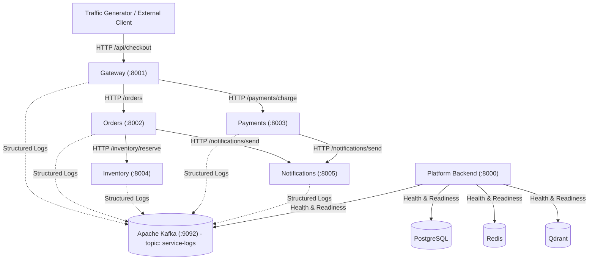

# AI Incident Intelligence Platform - Stage 1

A production-grade microservices foundation with structured JSON logging, distributed tracing propagation, real Apache Kafka ingestion with auto-topic creation, configurable failure simulation, and containerized Docker orchestration.

---

## 1. System Architecture

The Stage 1 architecture establishes 5 lightweight, independently containerized FastAPI microservices and the platform Backend service (which exclusively handles health, dependency verification, and readiness probes in Stage 1):



### Microservices Summary

| Service | Port | Responsibilities | Downstream Calls |
| :--- | :--- | :--- | :--- |
| **Gateway** | `8001` | Ingress coordinator for client transactions, failure config proxy | `Orders`, `Payments` |
| **Orders** | `8002` | Order persistence and workflow orchestration | `Inventory`, `Notifications` |
| **Inventory** | `8004` | Product catalog stock queries and reservations | None |
| **Payments** | `8003` | Credit card / transaction authorization and capture | `Notifications` |
| **Notifications** | `8005` | Simulated email / webhook alert dispatching and history | None |
| **Backend** | `8000` | Future AI Incident Platform; verifies dependencies in Stage 1 | PostgreSQL, Redis, Kafka, Qdrant |

---

## 2. Canonical Logging Schema (`LogEventSchema`)

Every log emitted by all microservices strictly conforms to the canonical `LogEventSchema` (15 required fields):

```json
{
  "timestamp": "2026-09-05T10:15:30.123456+00:00",
  "service_name": "orders",
  "instance_id": "orders-container-01",
  "request_id": "550e8400-e29b-41d4-a716-446655440000",
  "trace_id": "c69560b2-8dd2-4af6-953e-9c6cd1395406",
  "session_id": "session-cust-123",
  "log_level": "INFO",
  "event_type": "http_request",
  "message": "Incoming POST /orders",
  "exception": null,
  "attributes": { "method": "POST", "path": "/orders" },
  "upstream_service": "gateway",
  "downstream_service": null,
  "deployment_version": "v1.0.0",
  "environment": "development"
}
```

### Tracing Propagation Middleware & HTTP Client
- **`TraceCorrelationMiddleware`**: Intercepts inbound HTTP requests, extracts or generates `x-trace-id`, `x-request-id`, and `x-session-id`, stores them in async context variables (`shared/logging/context.py`), and echoes them back in response headers.
- **`ServiceHttpClient`**: Persistent HTTP client utilizing connection pooling (`httpx.AsyncClient`) that automatically injects `x-trace-id`, `x-request-id`, `x-session-id`, and `x-upstream-service` into every outbound HTTP request header.
- The distributed `trace_id` remains invariant throughout the entire service hop chain (`Gateway -> Orders -> Inventory -> Payments -> Notifications`).

### Health Check Noise Reduction
- **Suppressed on Success**: Docker health checks (`/health`, `/health/live`, `/health/ready`) that succeed (`< 400`) do not emit `http_request` or `http_response` logs to Kafka. This keeps `service-logs` clean and focused on business requests and anomalies.
- **Logged on Failure**: Any health check returning `4xx`, `5xx`, or raising an exception emits an `ERROR` log (`event_type="health_check_failed"`) to Kafka, preserving critical incident signals.
- **Tracing Header Preservation**: Distributed tracing headers (`x-trace-id`, `x-request-id`, `x-session-id`) are still populated and returned on all health checks.

---

## 3. Kafka Logging Pipeline

- Real Apache Kafka broker running with Kraft mode in Docker (`apache/kafka:latest`).
- **Zero fake/in-memory buffering** in production code.
- **Automatic Topic Creation**: Kafka is configured with `KAFKA_AUTO_CREATE_TOPICS_ENABLE: "true"`. Publishing the first log to `service-logs` automatically registers and provisions the topic on the broker.
  > *Note: If automatic topic creation is disabled in remote production environments, create the `service-logs` topic using Kafka Admin scripts or GitOps automation prior to service launch.*
- **Producer Lifecycle**: `KafkaLogProducer` is maintained as a singleton inside each service. It connects once on service startup (`await producer.start()`), uses `send_and_wait()` with retries and reconnect logic during request handling, and flushes/closes once on service shutdown (`await producer.stop()`).

---

## 4. Configurable Failure Simulation

Each microservice integrates `FailureInjector` (`shared/failures/injector.py`) supporting 5 failure modes:
1. `database_timeout` (raises `DatabaseTimeoutException`, mapped to HTTP 504)
2. `network_timeout` (raises `NetworkTimeoutException`, mapped to HTTP 504)
3. `http_500` (raises `HTTPException(500)`)
4. `authentication_failure` (raises `HTTPException(401)`)
5. `retry_exhaustion` (raises `RetryExhaustionException`, mapped to HTTP 503)

### Dynamic Runtime Reconfiguration
Configure failures dynamically without restarting containers:
```bash
curl -X POST http://localhost:8001/simulate-failure \
  -H "Content-Type: application/json" \
  -d '{
    "failure_rate": 0.5,
    "enabled_failures": ["database_timeout", "http_500"],
    "trigger_after_n_calls": 5,
    "target_operation": "checkout"
  }'
```
- **`target_operation`**: Target a specific endpoint operation (`"checkout"`, `"orders"`, `"health"`, etc.). By default, `/health` endpoints will **never** fail during generic failure simulation, preserving Docker health probes unless `target_operation: "health"` is explicitly specified.
- **`trigger_after_n_calls`**: Ensures traffic initially succeeds before failure injection activates.
- **`failure_rate`**: Configurable floating-point probability between `0.0` and `1.0`.

---

## 5. Docker Setup & Startup

All services, databases, messaging brokers, and vector stores run in individual Docker containers.

### Start All Services
```bash
docker compose up -d
```

### Verify Container Health
```bash
docker compose ps
```
All 10 services should display status `Up` (and `healthy` where healthchecks are configured):
- `postgres` (port 5432)
- `kafka` (port 9092)
- `redis` (port 6379)
- `qdrant` (ports 6333, 6334)
- `gateway` (port 8001)
- `orders` (port 8002)
- `inventory` (port 8004)
- `payments` (port 8003)
- `notifications` (port 8005)
- `backend` (port 8000)

### Platform Backend Startup Verification
The backend service automatically connects and verifies dependencies on startup. Check the readiness probe:
```bash
curl http://localhost:8000/health/ready
```
Expected response:
```json
{
  "status": "ready",
  "service": "AI Incident Intelligence Platform",
  "checks": {
    "postgres": "ready",
    "redis": "ready",
    "kafka": "ready",
    "qdrant": "ready"
  }
}
```

---

## 6. Running Test Suites

Two test suites are maintained and run entirely within Docker without host virtual environments:

### Suite 1: Fast Integration & Unit Tests (ASGITransport)
Runs in-memory across the 5 microservices using `ASGITransport` and Kafka test spies:
```bash
docker compose run --rm test-runner pytest tests/unit tests/integration/test_service_apis.py tests/integration/test_trace_propagation.py tests/integration/test_failure_simulation.py tests/integration/test_health_logging.py -v
```
Or via Makefile:
```bash
make test-fast
```

### Suite 2: Real Integration Tests (Live Docker & Real Kafka)
Validates real HTTP communication across Docker bridge networks, real Kafka message delivery, canonical schema validation, and failure logs:
```bash
docker compose run --rm test-runner pytest tests/integration/test_docker_real_kafka.py -v
```

---

## 7. Traffic Generation & Verification

### Generate Realistic Traffic
Generate load through the API Gateway:
```bash
# Inside Docker test runner:
docker compose run --rm test-runner python scripts/generate_traffic.py --gateway-url http://gateway:8001 --rate 5 --duration 10

# Or from the host machine:
python scripts/generate_traffic.py --gateway-url http://localhost:8001 --rate 5 --duration 10
```

CLI options:
- `--rate`: Requests per second (default: 5)
- `--duration`: Total test duration in seconds (default: 10)
- `--failure-rate`: Failure rate from 0.0 to 1.0 (default: 0.0)
- `--trigger-after`: Number of successful requests before failures start (default: 0)
- `--burst-size`: Concurrency burst size (default: 1)
- `--gateway-url`: API Gateway URL

### Manual Kafka Log Verification
Consume real messages directly from the Kafka broker container to inspect the JSON schema and distributed trace IDs:
```bash
docker compose exec kafka /opt/kafka/bin/kafka-console-consumer.sh \
  --bootstrap-server localhost:29092 \
  --topic service-logs \
  --from-beginning \
  --max-messages 5
```

### Manual Failure Verification
Trigger a 100% failure rate on the Orders service via the Gateway and observe the resulting failure logs in Kafka:
```bash
curl -X POST http://localhost:8001/simulate-failure \
  -H "Content-Type: application/json" \
  -d '{"target_service": "orders", "failure_rate": 1.0, "enabled_failures": ["http_500"]}'

curl -X POST http://localhost:8001/api/checkout \
  -H "Content-Type: application/json" \
  -d '{"user_id": "test-user", "items": [{"sku": "SKU-100", "quantity": 1, "unit_price": 20.0}]}'
```

---

## 8. Stage 2 Ready Boundaries

Stage 1 clean boundaries are established. When proceeding to Stage 2 (Log clustering and deduplication):
- Consume structured logs directly from Kafka topic `service-logs`.
- Ingest into HDBSCAN semantic clusterer without changing any microservice contracts.
