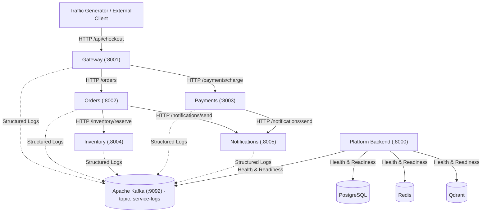
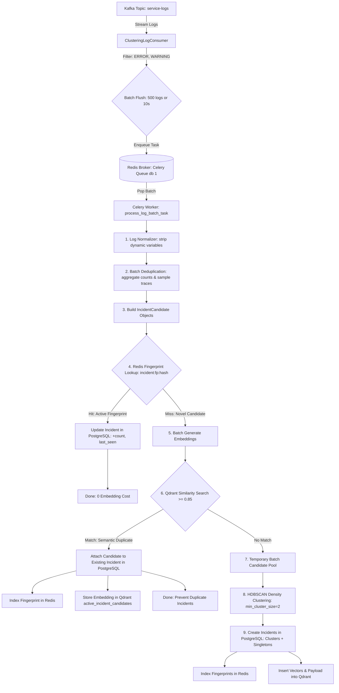

# AI Incident Intelligence Platform - Stage 1

A production-grade microservices foundation with structured JSON logging, distributed tracing propagation, real Apache Kafka ingestion with auto-topic creation, configurable failure simulation, and containerized Docker orchestration.

---

## 1. System Architecture

The Stage 1 architecture establishes 5 lightweight, independently containerized FastAPI microservices and the platform Backend service (which exclusively handles health, dependency verification, and readiness probes in Stage 1):



### Microservices Summary

| Service | Port | Responsibilities | Downstream Calls |
| :--- | :--- | :--- | :--- |
| **Gateway** | `8001` | Ingress coordinator for client transactions, failure config proxy | `Orders`, `Payments` |
| **Orders** | `8002` | Order persistence and workflow orchestration | `Inventory`, `Notifications` |
| **Inventory** | `8004` | Product catalog stock queries and reservations | None |
| **Payments** | `8003` | Credit card / transaction authorization and capture | `Notifications` |
| **Notifications** | `8005` | Simulated email / webhook alert dispatching and history | None |
| **Backend** | `8000` | Future AI Incident Platform; verifies dependencies in Stage 1 | PostgreSQL, Redis, Kafka, Qdrant |

---

## 2. Canonical Logging Schema (`LogEventSchema`)

Every log emitted by all microservices strictly conforms to the canonical `LogEventSchema` (15 required fields):

```json
{
  "timestamp": "2026-09-05T10:15:30.123456+00:00",
  "service_name": "orders",
  "instance_id": "orders-container-01",
  "request_id": "550e8400-e29b-41d4-a716-446655440000",
  "trace_id": "c69560b2-8dd2-4af6-953e-9c6cd1395406",
  "session_id": "session-cust-123",
  "log_level": "INFO",
  "event_type": "http_request",
  "message": "Incoming POST /orders",
  "exception": null,
  "attributes": { "method": "POST", "path": "/orders" },
  "upstream_service": "gateway",
  "downstream_service": null,
  "deployment_version": "v1.0.0",
  "environment": "development"
}
```

### Tracing Propagation Middleware & HTTP Client
- **`TraceCorrelationMiddleware`**: Intercepts inbound HTTP requests, extracts or generates `x-trace-id`, `x-request-id`, and `x-session-id`, stores them in async context variables (`shared/logging/context.py`), and echoes them back in response headers.
- **`ServiceHttpClient`**: Persistent HTTP client utilizing connection pooling (`httpx.AsyncClient`) that automatically injects `x-trace-id`, `x-request-id`, `x-session-id`, and `x-upstream-service` into every outbound HTTP request header.
- The distributed `trace_id` remains invariant throughout the entire service hop chain (`Gateway -> Orders -> Inventory -> Payments -> Notifications`).

### Health Check Noise Reduction
- **Suppressed on Success**: Docker health checks (`/health`, `/health/live`, `/health/ready`) that succeed (`< 400`) do not emit `http_request` or `http_response` logs to Kafka. This keeps `service-logs` clean and focused on business requests and anomalies.
- **Logged on Failure**: Any health check returning `4xx`, `5xx`, or raising an exception emits an `ERROR` log (`event_type="health_check_failed"`) to Kafka, preserving critical incident signals.
- **Tracing Header Preservation**: Distributed tracing headers (`x-trace-id`, `x-request-id`, `x-session-id`) are still populated and returned on all health checks.

---

## 3. Kafka Logging Pipeline

- Real Apache Kafka broker running with Kraft mode in Docker (`apache/kafka:latest`).
- **Zero fake/in-memory buffering** in production code.
- **Automatic Topic Creation**: Kafka is configured with `KAFKA_AUTO_CREATE_TOPICS_ENABLE: "true"`. Publishing the first log to `service-logs` automatically registers and provisions the topic on the broker.
  > *Note: If automatic topic creation is disabled in remote production environments, create the `service-logs` topic using Kafka Admin scripts or GitOps automation prior to service launch.*
- **Producer Lifecycle**: `KafkaLogProducer` is maintained as a singleton inside each service. It connects once on service startup (`await producer.start()`), uses `send_and_wait()` with retries and reconnect logic during request handling, and flushes/closes once on service shutdown (`await producer.stop()`).

---

## 4. Realistic Incident Simulation & Machine-Readable Error Codes

All artificial failure injection endpoints (`/simulate-failure`) and injector classes have been completely removed. Microservices behave as independent, production-grade services where failures stem naturally from realistic application code logic bugs, edge cases, and business exceptions.

### Machine-Readable Error Codes
Every error log emitted to Kafka contains a stable machine-readable `error_code` so downstream AI incident agents can perform root cause analysis and code remediation without parsing arbitrary English text:

| Service | Incident Trigger / Bug | Error Code | HTTP Status | Description |
| :--- | :--- | :--- | :---: | :--- |
| **Gateway** | Zero subtotal sample checkout | `ZeroDivisionError` | `500` | Division by zero in promotional discount calculation |
| **Orders** | Unrecognized customer tier | `KeyError` | `500` | Direct indexing on missing loyalty tier (e.g. `user-platinum-*`) |
| **Inventory** | Bulk order reservation (> 3 items) | `IndexError` | `500` | Off-by-one boundary error in multi-item warehouse batching |
| **Payments** | Unsupported currency lookup | `KeyError` | `500` | Missing currency in exchange rate map (e.g. `GBP`) |
| **Payments** | Card declined by issuing bank | `PAYMENT_DECLINED` | `402` | Natural business decline when payment method is `card_declined` |
| **Inventory** | Insufficient SKU stock | `OUT_OF_STOCK` | `409` | Requested quantity exceeds available catalog inventory |
| **Notifications**| Missing phone on SMS alert | `KeyError` | `500` | Unhandled phone number key lookup on SMS dispatch |

---

## 5. Docker Setup & Startup

All services, databases, messaging brokers, and vector stores run in individual Docker containers.

### Start All Services
```bash
docker compose up -d
```

### Verify Container Health
```bash
docker compose ps
```
All 10 services should display status `Up` (and `healthy` where healthchecks are configured):
- `postgres` (port 5432)
- `kafka` (port 9092)
- `redis` (port 6379)
- `qdrant` (ports 6333, 6334)
- `gateway` (port 8001)
- `orders` (port 8002)
- `inventory` (port 8004)
- `payments` (port 8003)
- `notifications` (port 8005)
- `backend` (port 8000)

### Platform Backend Startup Verification
The backend service automatically connects and verifies dependencies on startup. Check the readiness probe:
```bash
curl http://localhost:8000/health/ready
```
Expected response:
```json
{
  "status": "ready",
  "service": "AI Incident Intelligence Platform",
  "checks": {
    "postgres": "ready",
    "redis": "ready",
    "kafka": "ready",
    "qdrant": "ready"
  }
}
```

---

## 6. Running Test Suites

Two test suites are maintained and run entirely within Docker without host virtual environments:

### Suite 1: Fast Integration & Unit Tests (ASGITransport)
Runs in-memory across the 5 microservices using `ASGITransport` and Kafka test spies:
```bash
docker compose run --rm test-runner pytest tests/unit tests/integration/test_service_apis.py tests/integration/test_trace_propagation.py tests/integration/test_realistic_incidents.py tests/integration/test_health_logging.py -v
```
Or via Makefile:
```bash
make test-fast
```

### Suite 2: Real Integration Tests (Live Docker & Real Kafka)
Validates real HTTP communication across Docker bridge networks, real Kafka message delivery, canonical schema validation, and failure logs:
```bash
docker compose run --rm test-runner pytest tests/integration/test_docker_real_kafka.py -v
```

---

## 7. Production Traffic Simulator

A production-grade traffic simulator generates continuous, realistic user checkouts and real edge-case failures through the Gateway API.

### Run Traffic Simulator
```bash
# Inside Docker test runner:
docker compose run --rm test-runner python scripts/generate_traffic.py --gateway-url http://gateway:8001 --scenario mixed_incident --rate 5 --duration 10

# Or from host machine:
python scripts/generate_traffic.py --gateway-url http://localhost:8001 --scenario mixed_incident --rate 5 --duration 10
```

### Supported Scenarios (`--scenario`)
- `mixed_incident`: Realistic distribution of 85% normal checkouts and 15% intermittent edge-case bugs.
- `zero_division`: Promotional code `ZERO_SUBTOTAL` triggering Gateway `ZeroDivisionError`.
- `inventory_batch_overflow`: Multi-item bulk reservation triggering Inventory `IndexError`.
- `currency_lookup_error`: Unhandled foreign currency (`GBP`) triggering Payments `KeyError`.
- `customer_tier_error`: Unrecognized tier (`user-platinum-*`) triggering Orders `KeyError`.
- `payment_declines`: Natural card authorization declines (`402 PAYMENT_DECLINED`).
- `normal`: 100% successful standard checkout transactions.

### Simulator CLI Options
- `--scenario`: Incident scenario preset (default: `mixed_incident`)
- `--rate`: Target requests per second (default: `5.0`)
- `--duration`: Total execution duration in seconds (default: `10.0`)
- `--failure-rate`: Failure probability during incident phase (default: `0.15`)
- `--warmup`: Warm-up seconds of pure normal traffic before failures start (default: `2.0`)
- `--seed`: Integer seed for reproducible pseudo-random generation
- `--burst-size`: Concurrent requests per interval (default: `1`)

### Inspect Real Kafka Logs
Consume messages directly from the broker to inspect the canonical schema, trace IDs, and machine-readable `error_code` fields:
```bash
docker compose exec kafka /opt/kafka/bin/kafka-console-consumer.sh \
  --bootstrap-server localhost:29092 \
  --topic service-logs \
  --from-beginning \
  --max-messages 10
```

---

---

# Stage 2 – Incident Clustering & Deduplication

Stage 2 implements a streaming incident clustering and deduplication pipeline that consumes structured logs from Kafka, filters actionable errors (`ERROR`/`WARNING`), collapses repeated failures into incident candidates, utilizes Redis for high-speed active fingerprint lookups, leverages Qdrant for semantic similarity search, uses Celery workers with Redis queues for asynchronous batch processing, applies HDBSCAN density clustering on novel candidate pools, and persists all incidents in PostgreSQL as the single source of truth.

---

## 1. Stage 2 Architecture



---

## 2. Core Components & Responsibilities

### PostgreSQL (Single Source of Truth)
- **`incidents`**: Represents clustered failures. Stores `id`, `title`, `status` (`ACTIVE`, `RESOLVED`), `severity`, `primary_service`, `affected_services`, `total_occurrences`, `first_seen`, `last_seen`, `representative_log`, and timestamps.
- **`incident_candidates`**: Stores individual deduplicated candidate patterns belonging to an incident, including `fingerprint`, `service_name`, `error_code`, `event_type`, `normalized_text`, `occurrence_count`, `first_seen`, `last_seen`, and `sample_trace_ids`.

### Redis (Active Fingerprint Index)
- High-speed lookup mapping: `incident:fp:{sha256_hash} -> incident_id`.
- Configurable TTL (default: 2 days / 172800s).
- Entries exist strictly while an incident is active. No complete incident or log data is stored in Redis.

### Qdrant (Semantic Similarity Index)
- Collection: `active_incident_candidates`.
- Stores 384-dimensional dense vectors of active candidate text representations with payload (`incident_id`, `candidate_id`, `fingerprint`, `service_name`, `error_code`, `timestamp`).
- Queried with cosine distance threshold $\ge 0.85$.

### Celery Worker Queue
- Dedicated background worker (`celery-worker`) consuming from Redis queue (`redis://redis:6379/1`).
- Isolates CPU/GPU-intensive embedding generation, HDBSCAN clustering, and vector search from the ingestion stream.

### Continuous Kafka Consumer
- Dedicated streaming consumer (`clustering-consumer`) polling `service-logs`.
- Batches actionable logs on count (`N=500`) or time interval (`T=10.0s`), whichever triggers first.
- Emits task `process_log_batch_task.delay(batch)`.

---

## 3. Pluggable Embedding Providers

Configured via `EMBEDDING_PROVIDER` in `.env`:
- **`sentence-transformers`** (default): Local `all-MiniLM-L6-v2` model running within Docker container (384 dimensions, zero API cost).
- **`ollama`**: Pluggable provider for local/remote Ollama servers (`OLLAMA_BASE_URL`, `OLLAMA_EMBEDDING_MODEL`).
- **`gemini`**: Pluggable provider for Google Generative AI embeddings (`GEMINI_API_KEY`, `GEMINI_EMBEDDING_MODEL`).

---

## 4. REST API Endpoints

The platform exposes incident inspection APIs under `/api/v1/incidents`:

| Method | Endpoint | Description |
| :--- | :--- | :--- |
| `GET` | `/api/v1/incidents` | List incidents with optional `status`, `service`, `limit`, `offset` filters |
| `GET` | `/api/v1/incidents/{id}` | Detailed incident view with all candidate patterns and sample trace IDs |
| `GET` | `/api/v1/incidents/stats/summary` | Aggregated metrics: active/resolved counts, total occurrences, service breakdown |
| `POST` | `/api/v1/incidents/{id}/resolve` | Mark incident as `RESOLVED`, prune Redis fingerprints, and purge Qdrant vectors |

---

## 5. How to Run and Verify Stage 2

### Step 1: Start All Services in Docker
```bash
make up
# Or:
docker compose up -d
```
Verify running containers (`postgres`, `redis`, `kafka`, `qdrant`, `backend`, `celery-worker`, `clustering-consumer`, `gateway`, `orders`, `inventory`, `payments`, `notifications`):
```bash
make ps
```

### Step 2: Run Automated Stage 2 Tests
Execute the comprehensive unit and integration test suites inside the Docker test runner:
```bash
make test-stage2
```
Or directly:
```bash
docker compose run --rm test-runner pytest tests/unit/test_stage2_*.py tests/integration/test_stage2_clustering_pipeline.py -v
```

### Step 3: End-to-End Live Verification with Real Traffic
1. **Send simulated realistic traffic through Gateway**:
   ```bash
   docker compose run --rm test-runner python scripts/generate_traffic.py --gateway-url http://gateway:8001 --scenario mixed_incident --rate 10 --duration 15
   ```
2. **Observe continuous consumer logs**:
   ```bash
   docker compose logs --tail 30 clustering-consumer
   ```
3. **Observe Celery worker clustering batches**:
   ```bash
   docker compose logs --tail 30 celery-worker
   ```
4. **Query Incidents REST API**:
   ```bash
   curl http://localhost:8000/api/v1/incidents
   curl http://localhost:8000/api/v1/incidents/stats/summary
   ```
5. **Inspect active Redis fingerprints**:
   ```bash
   docker compose exec redis redis-cli keys "incident:fp:*"
   ```
6. **Inspect Qdrant vectors**:
   ```bash
   curl http://localhost:6333/collections/active_incident_candidates
   ```

