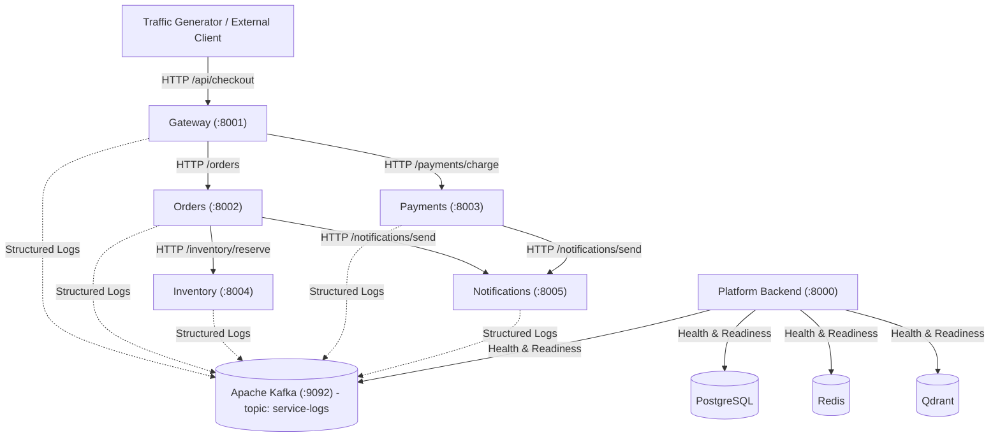
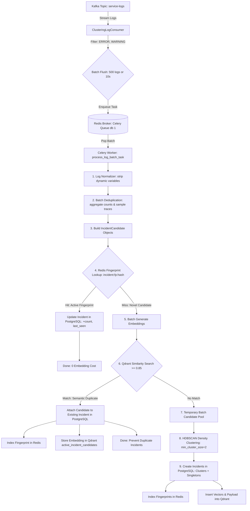
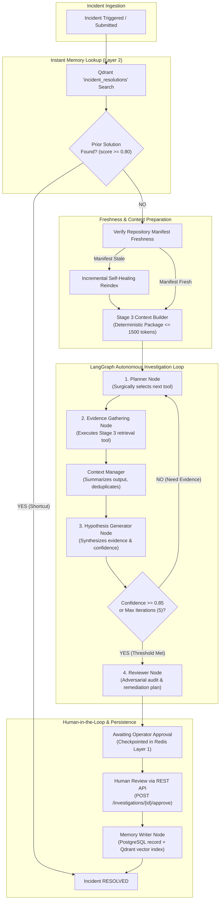

# AI Incident Intelligence Platform

A production-grade microservices foundation with structured JSON logging, distributed tracing propagation, real Apache Kafka ingestion with auto-topic creation, configurable failure simulation, and containerized Docker orchestration.

---

# Stage 1 – Microservices Foundation & Tracing Pipeline

## 1. System Architecture

The Stage 1 architecture establishes 5 lightweight, independently containerized FastAPI microservices and the platform Backend service (which exclusively handles health, dependency verification, and readiness probes in Stage 1):



### Microservices Summary

| Service | Port | Responsibilities | Downstream Calls |
| :--- | :--- | :--- | :--- |
| **Gateway** | `8001` | Ingress coordinator for client transactions, failure config proxy | `Orders`, `Payments` |
| **Orders** | `8002` | Order persistence and workflow orchestration | `Inventory`, `Notifications` |
| **Inventory** | `8004` | Product catalog stock queries and reservations | None |
| **Payments** | `8003` | Credit card / transaction authorization and capture | `Notifications` |
| **Notifications** | `8005` | Simulated email / webhook alert dispatching and history | None |
| **Backend** | `8000` | Future AI Incident Platform; verifies dependencies in Stage 1 | PostgreSQL, Redis, Kafka, Qdrant |

---

## 2. Canonical Logging Schema (`LogEventSchema`)

Every log emitted by all microservices strictly conforms to the canonical `LogEventSchema` (15 required fields):

```json
{
  "timestamp": "2026-09-05T10:15:30.123456+00:00",
  "service_name": "orders",
  "instance_id": "orders-container-01",
  "request_id": "550e8400-e29b-41d4-a716-446655440000",
  "trace_id": "c69560b2-8dd2-4af6-953e-9c6cd1395406",
  "session_id": "session-cust-123",
  "log_level": "INFO",
  "event_type": "http_request",
  "message": "Incoming POST /orders",
  "exception": null,
  "attributes": { "method": "POST", "path": "/orders" },
  "upstream_service": "gateway",
  "downstream_service": null,
  "deployment_version": "v1.0.0",
  "environment": "development"
}
```

### Tracing Propagation Middleware & HTTP Client
- **`TraceCorrelationMiddleware`**: Intercepts inbound HTTP requests, extracts or generates `x-trace-id`, `x-request-id`, and `x-session-id`, stores them in async context variables (`shared/logging/context.py`), and echoes them back in response headers.
- **`ServiceHttpClient`**: Persistent HTTP client utilizing connection pooling (`httpx.AsyncClient`) that automatically injects `x-trace-id`, `x-request-id`, `x-session-id`, and `x-upstream-service` into every outbound HTTP request header.
- The distributed `trace_id` remains invariant throughout the entire service hop chain (`Gateway -> Orders -> Inventory -> Payments -> Notifications`).

### Health Check Noise Reduction
- **Suppressed on Success**: Docker health checks (`/health`, `/health/live`, `/health/ready`) that succeed (`< 400`) do not emit `http_request` or `http_response` logs to Kafka. This keeps `service-logs` clean and focused on business requests and anomalies.
- **Logged on Failure**: Any health check returning `4xx`, `5xx`, or raising an exception emits an `ERROR` log (`event_type="health_check_failed"`) to Kafka, preserving critical incident signals.
- **Tracing Header Preservation**: Distributed tracing headers (`x-trace-id`, `x-request-id`, `x-session-id`) are still populated and returned on all health checks.

---

## 3. Kafka Logging Pipeline

- Real Apache Kafka broker running with Kraft mode in Docker (`apache/kafka:latest`).
- **Zero fake/in-memory buffering** in production code.
- **Automatic Topic Creation**: Kafka is configured with `KAFKA_AUTO_CREATE_TOPICS_ENABLE: "true"`. Publishing the first log to `service-logs` automatically registers and provisions the topic on the broker.
  > *Note: If automatic topic creation is disabled in remote production environments, create the `service-logs` topic using Kafka Admin scripts or GitOps automation prior to service launch.*
- **Producer Lifecycle**: `KafkaLogProducer` is maintained as a singleton inside each service. It connects once on service startup (`await producer.start()`), uses `send_and_wait()` with retries and reconnect logic during request handling, and flushes/closes once on service shutdown (`await producer.stop()`).

---

## 4. Realistic Incident Simulation & Machine-Readable Error Codes

All artificial failure injection endpoints (`/simulate-failure`) and injector classes have been completely removed. Microservices behave as independent, production-grade services where failures stem naturally from realistic application code logic bugs, edge cases, and business exceptions.

### Machine-Readable Error Codes
Every error log emitted to Kafka contains a stable machine-readable `error_code` so downstream AI incident agents can perform root cause analysis and code remediation without parsing arbitrary English text:

| Service | Incident Trigger / Bug | Error Code | HTTP Status | Description |
| :--- | :--- | :--- | :---: | :--- |
| **Gateway** | Zero subtotal sample checkout | `ZeroDivisionError` | `500` | Division by zero in promotional discount calculation |
| **Orders** | Unrecognized customer tier | `KeyError` | `500` | Direct indexing on missing loyalty tier (e.g. `user-platinum-*`) |
| **Inventory** | Bulk order reservation (> 3 items) | `IndexError` | `500` | Off-by-one boundary error in multi-item warehouse batching |
| **Payments** | Unsupported currency lookup | `KeyError` | `500` | Missing currency in exchange rate map (e.g. `GBP`) |
| **Payments** | Card declined by issuing bank | `PAYMENT_DECLINED` | `402` | Natural business decline when payment method is `card_declined` |
| **Inventory** | Insufficient SKU stock | `OUT_OF_STOCK` | `409` | Requested quantity exceeds available catalog inventory |
| **Notifications**| Missing phone on SMS alert | `KeyError` | `500` | Unhandled phone number key lookup on SMS dispatch |

---

## 5. Docker Setup & Startup

All services, databases, messaging brokers, and vector stores run in individual Docker containers.

### Start All Services
```bash
docker compose up -d
```

### Verify Container Health
```bash
docker compose ps
```
All 10 services should display status `Up` (and `healthy` where healthchecks are configured):
- `postgres` (port 5432)
- `kafka` (port 9092)
- `redis` (port 6379)
- `qdrant` (ports 6333, 6334)
- `gateway` (port 8001)
- `orders` (port 8002)
- `inventory` (port 8004)
- `payments` (port 8003)
- `notifications` (port 8005)
- `backend` (port 8000)

### Platform Backend Startup Verification
The backend service automatically connects and verifies dependencies on startup. Check the readiness probe:
```bash
curl http://localhost:8000/health/ready
```
Expected response:
```json
{
  "status": "ready",
  "service": "AI Incident Intelligence Platform",
  "checks": {
    "postgres": "ready",
    "redis": "ready",
    "kafka": "ready",
    "qdrant": "ready"
  }
}
```

---

## 6. Running Test Suites

Two test suites are maintained and run entirely within Docker without host virtual environments:

### Suite 1: Fast Integration & Unit Tests (ASGITransport)
Runs in-memory across the 5 microservices using `ASGITransport` and Kafka test spies:
```bash
docker compose run --rm test-runner pytest tests/unit tests/integration/test_service_apis.py tests/integration/test_trace_propagation.py tests/integration/test_realistic_incidents.py tests/integration/test_health_logging.py -v
```
Or via Makefile:
```bash
make test-fast
```

### Suite 2: Real Integration Tests (Live Docker & Real Kafka)
Validates real HTTP communication across Docker bridge networks, real Kafka message delivery, canonical schema validation, and failure logs:
```bash
docker compose run --rm test-runner pytest tests/integration/test_docker_real_kafka.py -v
```

---

## 7. Production Traffic Simulator

A production-grade traffic simulator generates continuous, realistic user checkouts and real edge-case failures through the Gateway API.

### Run Traffic Simulator
```bash
# Inside Docker test runner:
docker compose run --rm test-runner python scripts/generate_traffic.py --gateway-url http://gateway:8001 --scenario mixed_incident --rate 5 --duration 10

# Or from host machine:
python scripts/generate_traffic.py --gateway-url http://localhost:8001 --scenario mixed_incident --rate 5 --duration 10
```

### Supported Scenarios (`--scenario`)
- `mixed_incident`: Realistic distribution of 85% normal checkouts and 15% intermittent edge-case bugs.
- `zero_division`: Promotional code `ZERO_SUBTOTAL` triggering Gateway `ZeroDivisionError`.
- `inventory_batch_overflow`: Multi-item bulk reservation triggering Inventory `IndexError`.
- `currency_lookup_error`: Unhandled foreign currency (`GBP`) triggering Payments `KeyError`.
- `customer_tier_error`: Unrecognized tier (`user-platinum-*`) triggering Orders `KeyError`.
- `payment_declines`: Natural card authorization declines (`402 PAYMENT_DECLINED`).
- `normal`: 100% successful standard checkout transactions.

### Simulator CLI Options
- `--scenario`: Incident scenario preset (default: `mixed_incident`)
- `--rate`: Target requests per second (default: `5.0`)
- `--duration`: Total execution duration in seconds (default: `10.0`)
- `--failure-rate`: Failure probability during incident phase (default: `0.15`)
- `--warmup`: Warm-up seconds of pure normal traffic before failures start (default: `2.0`)
- `--seed`: Integer seed for reproducible pseudo-random generation
- `--burst-size`: Concurrent requests per interval (default: `1`)

### Inspect Real Kafka Logs
Consume messages directly from the broker to inspect the canonical schema, trace IDs, and machine-readable `error_code` fields:
```bash
docker compose exec kafka /opt/kafka/bin/kafka-console-consumer.sh \
  --bootstrap-server localhost:29092 \
  --topic service-logs \
  --from-beginning \
  --max-messages 10
```

---

---

# Stage 2 – Incident Clustering & Deduplication

Stage 2 implements a streaming incident clustering and deduplication pipeline that consumes structured logs from Kafka, filters actionable errors (`ERROR`/`WARNING`), collapses repeated failures into incident candidates, utilizes Redis for high-speed active fingerprint lookups, leverages Qdrant for semantic similarity search, uses Celery workers with Redis queues for asynchronous batch processing, applies HDBSCAN density clustering on novel candidate pools, and persists all incidents in PostgreSQL as the single source of truth.

---

## 1. Stage 2 Architecture



---

## 2. Core Components & Responsibilities

### PostgreSQL (Single Source of Truth)
- **`incidents`**: Represents clustered failures. Stores `id`, `title`, `status` (`ACTIVE`, `RESOLVED`), `severity`, `primary_service`, `affected_services`, `total_occurrences`, `first_seen`, `last_seen`, `representative_log`, and timestamps.
- **`incident_candidates`**: Stores individual deduplicated candidate patterns belonging to an incident, including `fingerprint`, `service_name`, `error_code`, `event_type`, `normalized_text`, `occurrence_count`, `first_seen`, `last_seen`, and `sample_trace_ids`.

### Redis (Active Fingerprint Index)
- High-speed lookup mapping: `incident:fp:{sha256_hash} -> incident_id`.
- Configurable TTL (default: 2 days / 172800s).
- Entries exist strictly while an incident is active. No complete incident or log data is stored in Redis.

### Qdrant (Semantic Similarity Index)
- Collection: `active_incident_candidates`.
- Stores 384-dimensional dense vectors of active candidate text representations with payload (`incident_id`, `candidate_id`, `fingerprint`, `service_name`, `error_code`, `timestamp`).
- Queried with cosine distance threshold $\ge 0.85$.

### Celery Worker Queue
- Dedicated background worker (`celery-worker`) consuming from Redis queue (`redis://redis:6379/1`).
- Isolates CPU/GPU-intensive embedding generation, HDBSCAN clustering, and vector search from the ingestion stream.

### Continuous Kafka Consumer
- Dedicated streaming consumer (`clustering-consumer`) polling `service-logs`.
- Batches actionable logs on count (`N=500`) or time interval (`T=10.0s`), whichever triggers first.
- Emits task `process_log_batch_task.delay(batch)`.

---

## 3. Pluggable Embedding Providers

Configured via `EMBEDDING_PROVIDER` in `.env`:
- **`sentence-transformers`** (default): Local `all-MiniLM-L6-v2` model running within Docker container (384 dimensions, zero API cost).
- **`ollama`**: Pluggable provider for local/remote Ollama servers (`OLLAMA_BASE_URL`, `OLLAMA_EMBEDDING_MODEL`).
- **`gemini`**: Pluggable provider for Google Generative AI embeddings (`GEMINI_API_KEY`, `GEMINI_EMBEDDING_MODEL`).

---

## 4. REST API Endpoints

The platform exposes incident inspection APIs under `/api/v1/incidents`:

| Method | Endpoint | Description |
| :--- | :--- | :--- |
| `GET` | `/api/v1/incidents` | List incidents with optional `status`, `service`, `limit`, `offset` filters |
| `GET` | `/api/v1/incidents/{id}` | Detailed incident view with all candidate patterns and sample trace IDs |
| `GET` | `/api/v1/incidents/stats/summary` | Aggregated metrics: active/resolved counts, total occurrences, service breakdown |
| `POST` | `/api/v1/incidents/{id}/resolve` | Mark incident as `RESOLVED`, prune Redis fingerprints, and purge Qdrant vectors |

---

## 5. How to Run and Verify Stage 2

### Step 1: Start All Services in Docker
```bash
make up
# Or:
docker compose up -d
```
Verify running containers (`postgres`, `redis`, `kafka`, `qdrant`, `backend`, `celery-worker`, `clustering-consumer`, `gateway`, `orders`, `inventory`, `payments`, `notifications`):
```bash
make ps
```

### Step 2: Run Automated Stage 2 Tests
Execute the comprehensive unit and integration test suites inside the Docker test runner:
```bash
make test-stage2
```
Or directly:
```bash
docker compose run --rm test-runner pytest tests/unit/test_stage2_*.py tests/integration/test_stage2_clustering_pipeline.py -v
```

### Step 3: End-to-End Live Verification with Real Traffic
1. **Send simulated realistic traffic through Gateway**:
   ```bash
   docker compose run --rm test-runner python scripts/generate_traffic.py --gateway-url http://gateway:8001 --scenario mixed_incident --rate 10 --duration 15
   ```
2. **Observe continuous consumer logs**:
   ```bash
   docker compose logs --tail 30 clustering-consumer
   ```
3. **Observe Celery worker clustering batches**:
   ```bash
   docker compose logs --tail 30 celery-worker
   ```
4. **Query Incidents REST API**:
   ```bash
   curl http://localhost:8000/api/v1/incidents
   curl http://localhost:8000/api/v1/incidents/stats/summary
   ```
5. **Inspect active Redis fingerprints**:
   ```bash
   docker compose exec redis redis-cli keys "incident:fp:*"
   ```
6. **Inspect Qdrant vectors**:
   ```bash
   curl http://localhost:6333/collections/active_incident_candidates
   ```

---

---

# Stage 3 – Repository Intelligence & Context Engine

Stage 3 implements a deterministic Repository Intelligence and Context Engine that statically indexes microservice repositories, extracts code symbols and routes using Python AST, maintains incremental SHA256 freshness manifests, builds a dynamic directed interaction graph using NetworkX, computes blast radius impact ratings, indexes code/documentation into Qdrant, exposes 14 deterministic retrieval tools, and synthesizes token-bounded `ContextPackage` objects for the upcoming Stage 4 investigation agent.

---

## 1. Stage 3 Architecture

```mermaid
flowchart TD
    subgraph Discovery ["1. Dynamic Discovery"]
        ROOTS["Configured Root (services/)"] --> DISC["RepositoryDiscovery"]
        DISC -->|Scan Subdirectories| SVCS["Discovered Services<br/>(Domain-Agnostic)"]
        DISC -.->|Ignore| IGN[".git, venv, __pycache__"]
    end

    subgraph Parsing ["2. AST Parsing & Chunking"]
        SVCS --> PARSER["CodeParser (ast.walk)"]
        PARSER -->|Functions, Classes, Methods, Constants| SYM_RAW["Extracted Symbols"]
        PARSER -->|@app.* / @router.* Decorators| ROUTES["Exposed HTTP Routes"]
        PARSER -->|http_client, httpx, Kafka Publish| OUT_CALLS["Outbound Calls"]
        PARSER -->|Symbol / Markdown Header Slicing| CHUNKS["Code & Doc Chunks"]
    end

    subgraph State ["3. Indexing & Freshness"]
        CHUNKS --> MAN["ManifestManager"]
        MAN -->|SHA256 Fingerprints| DIFF{"Incremental Diff:<br/>Added / Modified / Deleted / Unchanged"}
        DIFF -->|Changed Files Only| VEC["VectorIndexer (Qdrant: repository_code)"]
        DIFF -->|Unchanged Files| SKIP["Skip Embedding (0 Compute Cost)"]
        SYM_RAW & ROUTES --> SYMIDX["SymbolIndex (In-Memory Table)"]
        OUT_CALLS & ROUTES --> DGRAPH["DependencyGraph (NetworkX DiGraph)"]
    end

    subgraph Stage4 ["4. Deterministic Retrieval & Context Assembly"]
        SYMIDX & DGRAPH & VEC --> TOOLS["14 Retrieval Tools (RepositoryTools)"]
        TOOLS --> CTX_BLD["ContextBuilder"]
        CTX_BLD -->|Stack Trace Parsing + Snippets + Blast Radius| PKG["ContextPackage<br/>(Token Budget <= 3500)"]
    end
```

---

## 2. Core Subsystems & Responsibilities

### 1. Dynamic Discovery Engine (`discovery.py`)
- **Completely Domain-Agnostic**: Dynamically discovers any service directory residing inside `REPOSITORIES_ROOT_DIR` (e.g. `services/`) without hardcoding service names.
- **Noise Filtering**: Automatically ignores non-service directories such as `.git`, `__pycache__`, `venv`, `.venv`, and temporary artifacts.
- **Arbitrary External Service Registration**: Supports registering external repositories on arbitrary paths at runtime.

### 2. AST Parser & Document Chunker (`parser.py`)
- **100% Deterministic Parsing**: Uses Python's standard `ast` module to extract:
  - Top-level and class functions (`FunctionDef`, `AsyncFunctionDef`), signatures, and docstrings.
  - Class hierarchies (`ClassDef`) and enclosed methods.
  - Global constants (`Assign` with uppercase identifiers).
  - FastAPI/Starlette route definitions (`@app.get`, `@app.post`, etc.) extracting HTTP methods, paths, and response models.
  - Outbound HTTP calls (`http_client.post`, `httpx`, f-strings with service URL variables) and Kafka event publishing operations.
- **Granular Document Chunking**:
  - Code: Windowed slicing aligned to top-level symbol boundaries with line overlap.
  - Markdown: Segmented by `#` / `##` header sections for contextual documentation retrieval.
  - Configuration: Chunks Dockerfiles, `requirements.txt`, and settings files by logical blocks.

### 3. In-Memory Symbol Index (`symbol_index.py`)
- Fast in-memory symbol lookup supporting exact name matches, qualified method lookups (e.g. `OrderProcessor.execute`), and prefix/substring searches.
- Route registry cataloging all exposed HTTP endpoints across the entire system.
- Fine-grained invalidation: supports surgical re-indexing of individual files or services.

### 4. Dynamic Dependency Graph & Blast Radius (`dependency_graph.py`)
- Built on `networkx.DiGraph` representing service interactions (`Caller -> Callee`).
- **Edge Resolution**: Dynamically maps outbound HTTP calls to target services via URL host hints and endpoint path pattern matching across registered routes.
- **Blast Radius Calculation**:
  - **Direct Callers**: Immediate upstream services calling the target service.
  - **Transitive Callers (Ancestors)**: All upstream services across the dependency chain that will directly or indirectly fail if the target service goes down.
  - **Downstream Dependencies (Successors)**: Services required by the target service.
  - **Impact Level**: Deterministically graded (`CRITICAL`, `HIGH`, `MEDIUM`, `LOW`) based on caller count and graph centrality.

### 5. Manifest Manager & Incremental Diffing (`manifest.py`)
- Computes SHA256 hex digests for all repository files, persisted as JSON manifests in `backend/data/manifests/`.
- Computes file freshness diffs (`added`, `modified`, `deleted`, `unchanged`).
- Untouched files are completely skipped during re-indexing runs, eliminating redundant parsing and vector embedding operations.

### 6. Qdrant Vector Indexer (`vector_indexer.py`)
- Interfaces with Qdrant collection `repository_code` (384 dimensions, Cosine distance).
- Generates deterministic point UUIDs (`uuid5(NAMESPACE_URL, f"{service}:{file}:{start_line}")`) preventing duplicate points.
- Batches chunk embeddings using the platform's pluggable embedding provider (`SentenceTransformer`, `Ollama`, or `Gemini`).
- Supports filtered similarity search by service name and chunk type (`code`, `documentation`, `configuration`).

### 7. Master Indexer Orchestrator (`indexer.py`)
- Orchestrates multi-repository discovery, incremental diffing, AST parsing, vector upserts, and dependency graph updates.
- Automatically kicks off an asynchronous background index refresh during platform backend startup (`backend/main.py`).

---

## 3. The 14 Deterministic Retrieval Tools (`tools.py`)

Stage 3 provides 14 specialized retrieval tools designed for direct consumption by the Stage 4 Investigation Agent:

| # | Tool Name | Parameters | Return Type | Description |
| :-: | :--- | :--- | :--- | :--- |
| 1 | `search_code` | `query`, `service?`, `limit=5` | `List[Dict]` | Semantic vector search in Qdrant with lexical fallback. |
| 2 | `read_file` | `service`, `file_path`, `max_lines=300` | `Dict` | Reads file content with line numbers and truncation guard. |
| 3 | `read_lines` | `service`, `file_path`, `start_line`, `end_line` | `Dict` | Extracts specific 1-indexed line range with line numbers. |
| 4 | `find_symbol` | `symbol_name`, `service?` | `List[Dict]` | Resolves symbol definition, location, signature, and docstring. |
| 5 | `find_referencing_files` | `symbol_name`, `service?` | `List[Dict]` | Identifies source files containing references to a symbol. |
| 6 | `list_directory` | `service`, `relative_path=""` | `Dict` | Lists directory files, subdirectories, and file sizes. |
| 7 | `lookup_dependencies` | `service` | `Dict` | Returns direct upstream callers and downstream dependencies. |
| 8 | `get_blast_radius` | `service` | `Dict` | Assesses transitive failure impact, affected routes, and severity. |
| 9 | `get_service_routes` | `service` | `List[Dict]` | Lists all HTTP routes exposed by a given service. |
| 10 | `get_service_manifest` | `service` | `Dict` | Retrieves file checksums, chunk counts, and indexing timestamps. |
| 11 | `list_indexed_services` | None | `List[str]` | Lists all discovered and indexable microservices. |
| 12 | `get_topology_graph` | None | `Dict` | Exports full system dependency graph (nodes, edges, centrality). |
| 13 | `read_config` | `service`, `config_name` | `Dict` | Reads configuration files (Dockerfile, requirements, settings). |
| 14 | `build_incident_context` | `incident_id?`, `service`, `error_trace?`, `file_paths?`, `token_budget?` | `Dict` | Assembles a token-bounded `ContextPackage` for an incident. |

---

## 4. Token-Bounded Context Package Synthesizer (`context_builder.py`)

The Context Builder packages essential diagnostic code context while strictly respecting token budgets:
1. **Traceback Parsing**: Regex-extracts referenced source files and line numbers from error stack traces.
2. **Surgical Code Excerpts**: Extracts line slices (±15 lines around the error line) with numbered lines.
3. **Symbol Correlation**: Matches relevant symbols, function signatures, and method docstrings.
4. **Dependency & Blast Radius Injection**: Appends upstream callers, downstream services, and affected endpoints.
5. **Strict Token Budgeting**: Implements character-to-token budgeting (~4 chars per token, default `STAGE3_MAX_CONTEXT_TOKENS = 3500`). Prioritizes error snippets and blast radius over secondary search hits, setting `truncated = True` if the budget is reached.

---

## 5. REST API Endpoints

The repository intelligence engine exposes REST APIs mounted under `/api/v1/repositories` and `/api/v1/context`:

| Method | Endpoint | Description |
| :--- | :--- | :--- |
| `GET` | `/api/v1/repositories` | List discovered repositories with file, chunk, and symbol counts |
| `GET` | `/api/v1/repositories/status` | Indexer health metrics, total indexed symbols, and graph size |
| `POST` | `/api/v1/repositories/reindex` | Trigger incremental reindexing across all discovered repositories (`?force=true` for full refresh) |
| `POST` | `/api/v1/repositories/reindex/{service}` | Trigger incremental reindexing for a specific service repository |
| `GET` | `/api/v1/repositories/dependency-graph` | Export full system topology with in/out degree centrality metrics |
| `GET` | `/api/v1/repositories/blast-radius/{service}` | Calculate blast radius, transitive callers, and affected routes for a service |
| `GET` | `/api/v1/repositories/symbols/search` | Search symbols across repositories with optional `query`, `service`, and `symbol_type` filters |
| `GET` | `/api/v1/repositories/search` | Semantically search indexed code chunks across repositories (`?query=...&service=...`) |
| `GET` | `/api/v1/repositories/files/content` | Read source file or line range (`?service=...&path=...&start_line=...&end_line=...`) |
| `GET` | `/api/v1/repositories/routes/{service}` | Retrieve all registered HTTP route endpoints for a service |
| `POST` | `/api/v1/context/build` | Synthesize a token-bounded `ContextPackage` for incident investigation |

### Example: Build Incident Context Package
**Request**:
```bash
curl -X POST http://localhost:8000/api/v1/context/build \
  -H "Content-Type: application/json" \
  -d '{
    "service": "orders",
    "incident_id": "c69560b2-8dd2-4af6-953e-9c6cd1395406",
    "error_trace": "Traceback (most recent call last):\n  File \"/app/services/orders/main.py\", line 118, in create_order\n    multiplier = CUSTOMER_TIERS[tier]\nKeyError: '\''PLATINUM'\''",
    "token_budget": 2000
  }'
```

**Response**:
```json
{
  "incident_id": "c69560b2-8dd2-4af6-953e-9c6cd1395406",
  "primary_service": "orders",
  "target_files": ["main.py"],
  "code_snippets": [
    {
      "service_name": "orders",
      "file_path": "main.py",
      "start_line": 103,
      "end_line": 133,
      "content": " 103: async def create_order(request: OrderRequest):\n ...\n 118:     multiplier = CUSTOMER_TIERS[tier]\n ...",
      "reason": "Stack trace error site around line 118"
    }
  ],
  "symbols": [
    {
      "name": "create_order",
      "symbol_type": "route",
      "service_name": "orders",
      "file_path": "main.py",
      "start_line": 103,
      "end_line": 133,
      "signature": "@app.post(\"/orders\")",
      "docstring": "Process incoming order and reserve inventory."
    }
  ],
  "dependency_summary": {
    "service": "orders",
    "downstream_dependencies": ["inventory", "notifications"],
    "upstream_callers": ["gateway"]
  },
  "blast_radius": {
    "target_service": "orders",
    "impact_level": "HIGH",
    "direct_callers": ["gateway"],
    "transitive_callers": ["gateway"],
    "downstream_dependencies": ["inventory", "notifications"],
    "affected_routes": [
      "[ORDERS] POST /orders",
      "[GATEWAY] POST /api/checkout"
    ],
    "summary": "Failure in 'orders' impacts 1 upstream service(s) (gateway). Direct callers: 1; Downstream dependencies: 2."
  },
  "estimated_tokens": 420,
  "token_budget": 2000,
  "truncated": false
}
```

---

## 6. How to Run and Verify Stage 3

### Step 1: Run Automated Stage 3 Unit Tests
Run the complete Stage 3 test suite within the Docker test runner:
```bash
docker compose run --rm test-runner pytest tests/unit/test_stage3_*.py -v
```

### Step 2: Run the Full Platform Unit & Integration Suites
Verify that Stages 1, 2, and 3 run without conflicts:
```bash
docker compose run --rm test-runner pytest tests/unit/ -v
docker compose run --rm test-runner pytest tests/integration/ -v
```

### Step 3: Query Stage 3 APIs Live
Inspect discovered repositories and system topology:
```bash
# List discovered repositories and indexing status
curl http://localhost:8000/api/v1/repositories

# View full system dependency graph
curl http://localhost:8000/api/v1/repositories/dependency-graph

# Check blast radius if 'inventory' service fails
curl http://localhost:8000/api/v1/repositories/blast-radius/inventory

# Search for symbols across all services
curl "http://localhost:8000/api/v1/repositories/symbols/search?query=checkout"
```

---

# Stage 4 – Autonomous Incident Investigation Agent

An autonomous SRE diagnostics and code investigation agent built on **LangGraph**, modeled after real software engineering reasoning workflows (similar to Claude Code / Codex). The agent is strictly **not a chatbot**; it is an autonomous problem-solving machine that traces distributed errors down to exact source code files, functions, and lines of failure, estimates architectural blast radius, and prepares actionable remediation proposals.

## 1. System Architecture



---

## 2. Pluggable Multi-Provider LLM Abstraction

The agent operates across a unified, dependency-free HTTP client abstraction (`BaseLLMProvider`) supporting all major cloud and self-hosted inference runtimes without heavy SDK requirements:

| Provider Key | Target Runtime / Engine | Default Model / Base URL |
| :--- | :--- | :--- |
| `openai` | OpenAI Cloud API | `gpt-4o-mini` (`https://api.openai.com/v1`) |
| `anthropic` | Anthropic Messages API | `claude-3-5-sonnet-20241022` (`https://api.anthropic.com/v1`) |
| `gemini` | Google Gemini API | `gemini-1.5-pro` (`https://generativelanguage.googleapis.com/v1beta`) |
| `groq` | Groq Cloud Ultra-Fast Inference | `llama-3.3-70b-versatile` (`https://api.groq.com/openai/v1`) |
| `ollama` | Local Ollama Instance | `qwen2.5-coder:latest` (`http://host.docker.internal:11434`) |
| `vllm` | High-Throughput vLLM Cluster | `meta-llama/Llama-3.1-8B-Instruct` (`http://localhost:8000/v1`) |
| `llamacpp` | Local llama.cpp Server | `default` (`http://localhost:8080/v1`) |
| `mock` | Deterministic Schema-Aware Mock | Zero-cost mock for CI/CD and offline unit testing |

Configured dynamically via environment variables:
```bash
LLM_PROVIDER=openai
OPENAI_API_KEY=sk-...
OPENAI_MODEL=gpt-4o-mini
```

---

## 3. 3-Layer Memory Architecture

| Layer | Technology | Lifetime | Purpose |
| :--- | :--- | :--- | :--- |
| **Layer 1: Execution Memory** | Redis | 24 Hours (`STAGE4_EXECUTION_MEMORY_TTL_SECONDS`) | Ephemeral LangGraph state checkpoints, visited file/symbol deduplication sets (`SADD`/`SMEMBERS`), and state recovery across worker restarts. |
| **Layer 2: Incident Memory** | PostgreSQL + Qdrant | Permanent | Relational `IncidentResolution` audit records paired with semantic vector embeddings in Qdrant (`incident_resolutions` collection). Enables **0-token, sub-second instant resolution** when recurring incidents occur. |
| **Layer 3: Code Intelligence** | In-Memory AST + Qdrant | Incremental | Stage 3 Symbol Index, static Call Graph topology, and chunk vector search powering surgical investigation tool actions. |

---

## 4. Context Manager & Extreme Token Minimization

To prevent runaway token costs and context degradation, the Context Manager enforces:
1. **Strict Token Budgets**: Global budget cap of 4,000 tokens (`STAGE4_TOKEN_BUDGET`).
2. **Aggressive Tool Summarization**:
   - `read_lines`: Slices code down to at most 12 critical lines around the target site, truncating with explicit omission indicators.
   - `search_code`: Retains top-1 match and condenses to 8 lines.
   - `find_symbol`: Extracts signature and file location, discarding AST boilerplate.
   - `find_callers` / `blast_radius`: Condenses graph edges into compact service name lists.
3. **Duplicate Tool Elimination**: Tracks all visited files and queried symbols in Redis execution memory; subsequent attempts to read the same file are intercepted and rejected with 0 token waste.
4. **Early Exit Threshold**: As soon as the Hypothesis node reaches `confidence >= 0.85`, the LangGraph loop terminates immediately and routes directly to the Reviewer node.

---

## 5. REST API Reference

Mounted under `/api/v1/investigations`:

### 1. Trigger Autonomous Investigation
- **Endpoint**: `POST /api/v1/investigations/run`
- **Payload**:
```json
{
  "incident_id": "INC-PROD-101",
  "primary_service": "inventory",
  "title": "Deadlock detected during stock allocation",
  "error_message": "DatabaseLockTimeout: deadlock detected in inventory allocation",
  "error_trace": "File 'services/inventory/main.py', line 25, in reserve_stock\nraise DatabaseLockTimeout('deadlock')",
  "max_iterations": 3,
  "auto_approve": false
}
```
- **Response**: Returns investigation findings, computed blast radius, verified evidence items, hypothesis, and final report with status `AWAITING_APPROVAL`.

### 2. Retrieve Investigation Report
- **Endpoint**: `GET /api/v1/investigations/{incident_id}`
- **Response**: Returns current investigation checkpoint from Redis or permanent PostgreSQL record.

### 3. Submit Human Approval (HITL)
- **Endpoint**: `POST /api/v1/investigations/{incident_id}/approve`
- **Payload**:
```json
{
  "approved": true,
  "reviewer_feedback": "Confirmed deadlock lock order fix. Approved for deployment."
}
```
- **Response**: Persists resolution to PostgreSQL and embeds resolution vectors into Qdrant for future instant reuse.

---

## 6. Verification and Live Demonstration

### Run Stage 4 Automated Test Suite
```bash
docker compose run --rm test-runner pytest tests/unit/test_stage4_*.py -v
```

### Run Full Platform Regression Suite (Stages 1 - 4)
```bash
docker compose run --rm test-runner pytest tests/unit/ -v
docker compose run --rm test-runner pytest tests/integration/ -v
```

### Live End-to-End Demonstration via cURL

```bash
# 1. Trigger Investigation on 'inventory' deadlock
curl -X POST http://localhost:8000/api/v1/investigations/run \
  -H "Content-Type: application/json" \
  -d '{
    "incident_id": "INC-DEMO-001",
    "primary_service": "inventory",
    "title": "Inventory deadlock error",
    "error_message": "DatabaseLockTimeout: deadlock detected in inventory allocation",
    "max_iterations": 2
  }'

# 2. Inspect Investigation State (Awaiting Operator Approval)
curl http://localhost:8000/api/v1/investigations/INC-DEMO-001

# 3. Submit Human Approval (Commits to Postgres & Qdrant)
curl -X POST http://localhost:8000/api/v1/investigations/INC-DEMO-001/approve \
  -H "Content-Type: application/json" \
  -d '{
    "approved": true,
    "reviewer_feedback": "Approved fix."
  }'

# 4. Trigger identical incident to observe Instant Cache HIT (0 LLM loops, 0 tokens)
curl -X POST http://localhost:8000/api/v1/investigations/run \
  -H "Content-Type: application/json" \
  -d '{
    "incident_id": "INC-DEMO-002",
    "primary_service": "inventory",
    "title": "Inventory deadlock error",
    "error_message": "DatabaseLockTimeout: deadlock detected in inventory allocation",
    "max_iterations": 2
  }'
```

