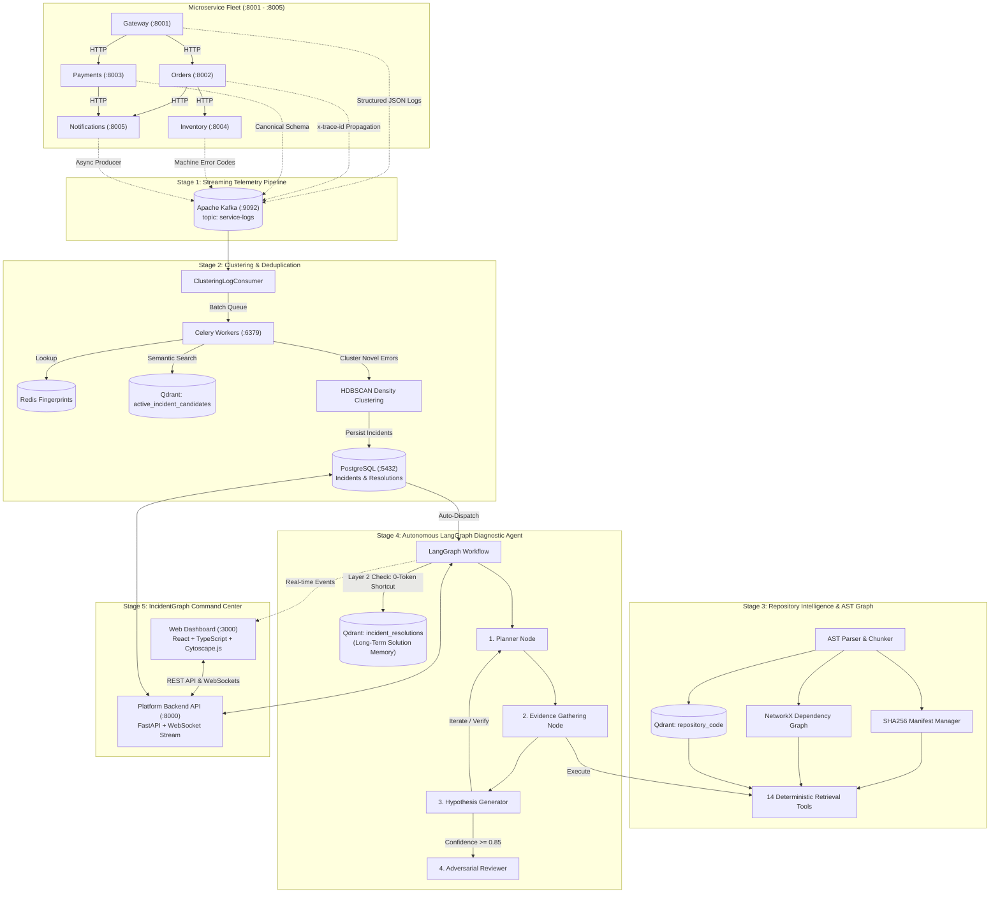

# IncidentGraph: System Architecture & Design

Comprehensive architectural documentation for the **IncidentGraph: Autonomous AI Incident Intelligence Platform**.

---

## 1. High-Level System Architecture

IncidentGraph is an end-to-end autonomous incident detection, clustering, diagnostic, and resolution platform. It continuously ingests structured telemetry from distributed microservices, clusters errors into causal incidents, performs autonomous root cause analysis down to source code lines using LangGraph, and presents an interactive SRE command center with Human-in-the-Loop approval.

---

## 2. Core Architectural Subsystems

### Stage 1: Microservice Fleet & Distributed Tracing
- **Microservices**: 5 containerized FastAPI services running checkout, order management, stock reservation, credit authorization, and notification alerts.
- **`TraceCorrelationMiddleware`**: Intercepts inbound HTTP requests, extracts or generates `x-trace-id`, `x-request-id`, and `x-session-id`, stores them in Python `contextvars`, and returns them in response headers.
- **`ServiceHttpClient`**: Pooled HTTP client injecting distributed tracing headers across all inter-service hops.
- **Canonical Schema (`LogEventSchema`)**: 15 required fields including timestamp, service name, trace ID, session ID, log level, event type, message, exception traceback, machine-readable `error_code`, and deployment metadata.
- **Kafka Logging Pipeline**: Real Apache Kafka broker with singleton async producers, automatic topic creation (`service-logs`), and health check noise filtering.

### Stage 2: Streaming Incident Clustering & Deduplication
- **`ClusteringLogConsumer`**: Continuously streams from `service-logs`, buffers actionable error logs (`ERROR` / `WARNING`), and flushes batches every 500 logs or 10 seconds.
- **Log Normalization**: Replaces dynamic variables (UUIDs, timestamps, order IDs, hex memory addresses) with generic tokens to produce deterministic error fingerprints.
- **Tiered Deduplication**:
  1. **Redis Tier**: O(1) active fingerprint hash lookup (`incident:fp:<hash>`). Matching logs increment occurrence counts and update timestamps with zero LLM/embedding cost.
  2. **Qdrant Semantic Tier**: Computes dense vector embeddings using `all-MiniLM-L6-v2` and searches `active_incident_candidates` at cosine similarity $\ge 0.85$. Matches attach to existing incidents.
  3. **HDBSCAN Clustering Tier**: Novel candidates are clustered using HDBSCAN density clustering (`min_cluster_size=2`), forming multi-fault incidents or singletons.
- **PostgreSQL Persistence**: Stores `incidents` and `incident_candidates` as the single source of truth.

### Stage 3: Repository Intelligence & Context Engine
- **Domain-Agnostic Discovery**: Dynamically scans `services/` without hardcoded service registries, ignoring non-service directories (`.git`, `__pycache__`, `venv`).
- **AST Parsing & Chunking**: Uses standard library `ast` to parse functions, classes, decorators, routes (`@app.get`, `@app.post`), and outbound calls.
- **SHA256 Manifest Manager**: Tracks per-file SHA256 checksums to support incremental reindexing.
- **NetworkX Topology Graph**: Builds a directed microservice dependency graph, identifying upstream callers, downstream dependencies, and computing blast radius impact scores.
- **14 Deterministic Retrieval Tools**: Exposes tools for code reading (`read_lines`, `read_file`), symbol lookup (`find_symbol`), semantic search (`search_code`), topology inspection (`get_blast_radius`, `find_callers`, `find_dependencies`, `get_service_routes`), and configuration inspection (`read_config`, `list_directory`).

### Stage 4: Autonomous LangGraph Diagnostic Agent
- **Dual-Layer Memory**:
  - *Layer 1 (Working Context)*: Redis checkpointing per incident state across graph iterations.
  - *Layer 2 (Long-Term Solution Memory)*: Qdrant `incident_resolutions` collection. When an incident occurs, the agent first queries Qdrant; if similarity $\ge 0.80$, it immediately reuses the validated solution (0-token shortcut).
- **LangGraph Multi-Node Workflow**:
  1. `context_builder_node`: Prepares token-bounded package with stack trace snippets and blast radius.
  2. `planner_node`: Surgically selects the next single tool action to verify failure mechanisms.
  3. `tool_execution_node`: Dispatches repository tools with timeout enforcement and line-range deduplication (`visited_ranges`).
  4. `hypothesis_generator_node`: Synthesizes evidence into a working hypothesis with confidence scoring.
  5. `reviewer_node`: Adversarial audit checking evidence grounding and drafting concrete remediation code patches.
  6. `human_approval_node`: Checkpoints state in `AWAITING_APPROVAL`.
  7. `memory_writer_node`: Commits approved resolutions to PostgreSQL and indexes embeddings into Qdrant.

### Stage 5: IncidentGraph Dashboard & Real-Time Intelligence
- **Frontend Stack**: React 18, TypeScript, Vite, Cytoscape.js, Lucide icons, responsive light theme with clean minimalist aesthetics.
- **Live Fleet Health Grid**: Probes all 5 microservices and 4 infrastructure components with real-time response latency (ms).
- **WebSocket Streaming**: Ingests real-time events (`incident:created`, `agent:step`, `agent:approved`, `agent:rejected`, `incident:updated`).
- **Cytoscape.js Dependency Graph**: Interactive topology canvas rendering service nodes, database nodes, directional call arrows, and blast radius overlays.
- **Agent Inspector**: Real-time visualization of agent iterations, token consumption, confidence gauge, evolving hypothesis, and full tool execution traces.
- **Human-in-the-Loop Review Modal**: One-click review with **Approve & Commit to Memory** and **Reject Fix** buttons, hiding actions once resolved/rejected.

---

## 3. Data Storage & Infrastructure Topology

| Store | Technology | Port | Purpose |
| :--- | :--- | :--- | :--- |
| **Relational DB** | PostgreSQL 16 | `5432` | Canonical storage for `incidents`, `incident_candidates`, and `incident_resolutions`. |
| **Message Broker** | Apache Kafka (Kraft) | `9092` | High-throughput distributed log streaming topic (`service-logs`). |
| **Cache & State** | Redis 7 | `6379` | Active fingerprint index, Celery task broker, LangGraph Redis checkpoints. |
| **Vector Database** | Qdrant | `6333` | Vector collections: `active_incident_candidates`, `repository_code`, and `incident_resolutions`. |
| **Task Queue** | Celery 5.4 | Background | Asynchronous log batch clustering and autonomous agent dispatch. |
| **Web Gateway** | Nginx 1.27 | `3000` | Frontend web server and reverse proxy routing API and WebSocket requests to Backend. |

---

## 4. Resilience & Error Boundaries

1. **Tool Execution Isolation**: Every tool call is timeout-bounded (30s) and wrapped in exception handlers in `AgentToolDispatcher`. Tool failures become structured evidence items rather than crashing the agent.
2. **Context Manager Deduplication**: Line-range deduplication (`visited_ranges`) prevents infinite tool call loops while allowing multi-point code inspection.
3. **Dual-Path Routing Compatibility**: Backend API router mounts agent endpoints at both `/api/v1/investigations` and `/api/v1/agent` for seamless client compatibility.
4. **Resolution Fallback**: If an incident resolution is approved before the agent completes all iterations, the system synthesizes a valid resolution from active hypothesis and database state.
