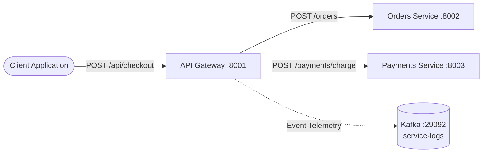

# API Gateway Service

The **API Gateway** is the central entry point and distributed transaction orchestrator for the e-commerce microservices platform. It provides a single, unified API interface for client applications, orchestrates end-to-end checkout workflows across downstream domain services, and handles distributed request tracing and telemetry.

---

## Architecture & Responsibilities



### Core Features
- **Transaction Orchestration**: Coordinates multi-step checkout processes by sequentially interacting with the Orders service (order creation and inventory reservation) and the Payments service (payment authorization and capture).
- **Request Routing & Proxying**: Exposes public-facing endpoints (such as order status queries) and transparently delegates calls to backend microservices.
- **Distributed Tracing**: Automatically injects and propagates W3C/custom correlation headers (`x-trace-id`, `x-request-id`, `x-session-id`) to maintain end-to-end trace context across service hops.
- **Telemetry & Logging**: Emits structured JSON access logs and error events to Kafka for centralized auditing and monitoring.

---

## Configuration

The service is configured via environment variables:

| Variable | Type | Default | Description |
| :--- | :---: | :--- | :--- |
| `SERVICE_NAME` | String | `gateway` | Unique service identifier for logs and trace context. |
| `PORT` | Integer | `8001` | HTTP server port. |
| `ORDERS_SERVICE_URL` | String | `http://orders:8002` | Downstream Orders microservice base URL. |
| `PAYMENTS_SERVICE_URL` | String | `http://payments:8003` | Downstream Payments microservice base URL. |
| `KAFKA_BOOTSTRAP_SERVERS` | String | `localhost:9092` | Kafka broker address for event logging. |

---

## API Reference

### 1. Health Check
Checks if the gateway service is online and healthy.

```http
GET /health
```

#### Response (`200 OK`)
```json
{
  "status": "ok",
  "service": "gateway"
}
```

---

### 2. Execute Checkout
Orchestrates order placement, stock reservation, and payment processing in a single atomic transaction.

```http
POST /api/checkout
Content-Type: application/json
```

#### Request Body
```json
{
  "user_id": "user-1001",
  "items": [
    {
      "sku": "SKU-100",
      "quantity": 2,
      "unit_price": 25.0
    }
  ],
  "payment_method": "credit_card",
  "currency": "USD",
  "discount_code": "SAVE10"
}
```

#### Request Parameters
- `user_id` *(string, required)*: Identifier of the customer placing the order.
- `items` *(array, required)*: List of line items to purchase.
  - `sku` *(string, required)*: Product stock keeping unit.
  - `quantity` *(integer, optional, default: 1)*: Units requested.
  - `unit_price` *(number, optional, default: 25.0)*: Unit cost.
- `payment_method` *(string, optional, default: "credit_card")*: Method used for authorization.
- `currency` *(string, optional, default: "USD")*: 3-letter currency code.
- `discount_code` *(string, optional)*: Promotional coupon code (e.g., `"SAVE10"`).

#### Success Response (`200 OK`)
```json
{
  "status": "COMPLETED",
  "order": {
    "order_id": "ord-7f9a12b3",
    "user_id": "user-1001",
    "items": [
      {
        "sku": "SKU-100",
        "quantity": 2,
        "unit_price": 25.0
      }
    ],
    "total_amount": 50.0,
    "currency": "USD",
    "loyalty_points": 50,
    "status": "CONFIRMED"
  },
  "payment": {
    "transaction_id": "tx-8a2b3c4d",
    "user_id": "user-1001",
    "amount": 50.0,
    "currency": "USD",
    "order_id": "ord-7f9a12b3",
    "payment_method": "credit_card",
    "status": "CAPTURED"
  }
}
```

#### Downstream Error Responses
If a downstream dependency rejects the request, the Gateway propagates the appropriate error status and payload:
- `400 Bad Request`: Validation failure (empty items list or missing user ID).
- `404 Not Found`: Target SKU not found in product catalog.
- `409 Conflict`: Insufficient inventory stock (`OUT_OF_STOCK`).
- `402 Payment Required`: Payment declined by card issuer or limit exceeded.

---

### 3. Get Order Details (Proxy)
Retrieves the order record from the Orders service.

```http
GET /api/orders/{order_id}
```

#### Response (`200 OK`)
```json
{
  "order_id": "ord-7f9a12b3",
  "user_id": "user-1001",
  "items": [
    {
      "sku": "SKU-100",
      "quantity": 2,
      "unit_price": 25.0
    }
  ],
  "total_amount": 50.0,
  "currency": "USD",
  "loyalty_points": 50,
  "status": "CONFIRMED"
}
```

---

## Running Locally

### With Python
```powershell
pip install -r services/requirements.txt
uvicorn services.gateway.main:app --host 0.0.0.0 --port 8001 --reload
```

### With Docker Compose
```powershell
docker compose up -d gateway
```
