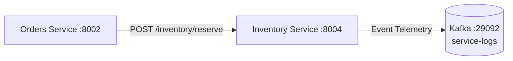

# Inventory Service

The **Inventory Service** manages product catalog stock levels, handles item availability inquiries, and executes stock reservations requested by the **Orders** service during customer checkout.

---

## Architecture & Responsibilities



### Core Features
- **Stock Management**: Maintains accurate, real-time product quantities in an in-memory catalog store.
- **Stock Reservation**: Validates requested quantities against available stock, atomically deducting items upon successful order reservations.
- **Out-of-Stock Handling**: Returns descriptive HTTP 409 conflict errors with available vs requested counts when inventory is depleted.
- **Event Telemetry**: Dispatches audit events (`stock_checked`, `stock_reserved`, `stock_reservation_failed`) to Kafka.

---

## Configuration

The service is configured via environment variables:

| Variable | Type | Default | Description |
| :--- | :---: | :--- | :--- |
| `SERVICE_NAME` | String | `inventory` | Service identifier for logging and trace context. |
| `PORT` | Integer | `8004` | HTTP server port. |
| `KAFKA_BOOTSTRAP_SERVERS` | String | `localhost:9092` | Kafka broker address for event logging. |

---

## Product Catalog

The service initializes with a default set of standard e-commerce catalog items:

| SKU | Initial Stock | Description |
| :--- | :---: | :--- |
| `SKU-100` | `100` | Standard high-volume catalog item. |
| `SKU-200` | `50` | Moderate-inventory catalog item. |
| `SKU-LIMITED` | `2` | Limited promotional item. |
| `SKU-OUT-OF-STOCK` | `0` | Out-of-stock catalog item. |

---

## API Reference

### 1. Health Check
Checks if the inventory service is running.

```http
GET /health
```

#### Response (`200 OK`)
```json
{
  "status": "ok",
  "service": "inventory"
}
```

---

### 2. Query SKU Stock
Returns current stock availability for a given product SKU.

```http
GET /inventory/{sku}
```

#### Success Response (`200 OK`)
```json
{
  "sku": "SKU-100",
  "quantity": 100
}
```

#### Error Response (`404 Not Found`)
Returned when the SKU does not exist in the catalog:
```json
{
  "detail": "SKU 'SKU-UNKNOWN' not found"
}
```

---

### 3. Reserve Stock
Reserves and deducts inventory for one or more items in an order.

```http
POST /inventory/reserve
Content-Type: application/json
```

#### Request Body
```json
{
  "items": [
    {
      "sku": "SKU-100",
      "quantity": 2
    },
    {
      "sku": "SKU-200",
      "quantity": 1
    }
  ]
}
```

#### Success Response (`200 OK`)
```json
{
  "status": "reserved",
  "items": [
    {
      "sku": "SKU-100",
      "quantity": 2
    },
    {
      "sku": "SKU-200",
      "quantity": 1
    }
  ]
}
```

#### Error Responses
- **`400 Bad Request`**: Empty items list (`EMPTY_ITEMS_LIST`) or invalid quantity (`INVALID_QUANTITY`).
- **`404 Not Found`**: SKU not found in product catalog (`SKU_NOT_FOUND`).
- **`409 Conflict`**: Insufficient stock available (`OUT_OF_STOCK`):
  ```json
  {
    "detail": "SKU 'SKU-LIMITED' is out of stock (available: 1, requested: 2)"
  }
  ```

---

## Running Locally

### With Python
```powershell
pip install -r services/requirements.txt
uvicorn services.inventory.main:app --host 0.0.0.0 --port 8004 --reload
```

### With Docker Compose
```powershell
docker compose up -d inventory
```

### Sample Stock Check
```powershell
curl http://localhost:8004/inventory/SKU-100
```
