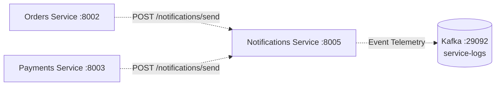

# Notifications Service

The **Notifications Service** manages multi-channel communications (email, SMS, webhook alerts) for the e-commerce platform. It handles asynchronous customer transactional messages triggered by order confirmations and payment events.

---

## Architecture & Responsibilities



### Core Features
- **Multi-Channel Delivery**: Supports routing notifications across `email`, `sms`, and `webhook` delivery channels.
- **Dispatch History**: Maintains an in-memory audit log of recently dispatched notifications for verification and tracking.
- **Trace Continuity**: Inherits distributed tracing headers from calling services, ensuring full observability across the customer journey.

---

## Configuration

The service is configured via environment variables:

| Variable | Type | Default | Description |
| :--- | :---: | :--- | :--- |
| `SERVICE_NAME` | String | `notifications` | Service identifier for logging and trace context. |
| `PORT` | Integer | `8005` | HTTP server port. |
| `KAFKA_BOOTSTRAP_SERVERS` | String | `localhost:9092` | Kafka broker address for event logging. |

---

## Supported Channels

| Channel | Destination Target | Required Payload Fields |
| :--- | :--- | :--- |
| `email` | Customer email address | `recipient`, `subject`, `body` |
| `sms` | Mobile phone number | `recipient`, `subject`, `body`, `metadata.phone_number` |
| `webhook` | Webhook endpoint URL | `recipient`, `subject`, `body`, `metadata` |

---

## API Reference

### 1. Health Check
Checks if the notifications service is running.

```http
GET /health
```

#### Response (`200 OK`)
```json
{
  "status": "ok",
  "service": "notifications"
}
```

---

### 2. Send Notification
Dispatches a notification to the specified recipient via the requested channel.

```http
POST /notifications/send
Content-Type: application/json
```

#### Request Body
```json
{
  "recipient": "customer@example.com",
  "subject": "Order Confirmation",
  "body": "Your order ord-7f9a12b3 has been confirmed.",
  "channel": "email",
  "order_id": "ord-7f9a12b3",
  "metadata": {}
}
```

#### Request Parameters
- `recipient` *(string, required)*: Destination user identifier or email.
- `subject` *(string, required)*: Notification subject or title.
- `body` *(string, required)*: Message text content.
- `channel` *(string, optional, default: "email")*: Channel (`"email"`, `"sms"`, or `"webhook"`).
- `order_id` *(string, optional)*: Related order reference.
- `metadata` *(object, optional)*: Channel-specific attributes (e.g. `{"phone_number": "+1234567890"}`).

#### Success Response (`200 OK`)
```json
{
  "status": "sent",
  "recipient": "customer@example.com",
  "channel": "email"
}
```

#### Error Response (`400 Bad Request`)
Returned if the `recipient` field is empty:
```json
{
  "detail": "Recipient cannot be empty"
}
```

---

### 3. Get Notification History
Retrieves the 50 most recent notifications dispatched by the service.

```http
GET /notifications/history
```

#### Success Response (`200 OK`)
```json
{
  "count": 1,
  "notifications": [
    {
      "recipient": "customer@example.com",
      "subject": "Order Confirmation",
      "body": "Your order ord-7f9a12b3 has been confirmed.",
      "channel": "email",
      "order_id": "ord-7f9a12b3",
      "metadata": {},
      "target": "customer@example.com"
    }
  ]
}
```

---

## Running Locally

### With Python
```powershell
pip install -r services/requirements.txt
uvicorn services.notifications.main:app --host 0.0.0.0 --port 8005 --reload
```

### With Docker Compose
```powershell
docker compose up -d notifications
```
