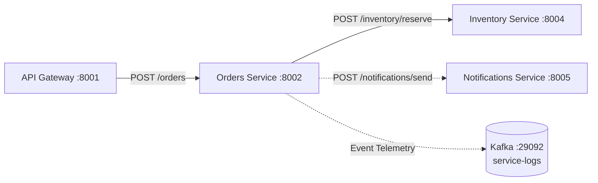

# Orders Service

The **Orders Service** manages the lifecycle of customer orders within the e-commerce platform. It handles order creation, coordinates product stock reservations with the **Inventory** service, calculates customer loyalty reward points, and dispatches asynchronous order confirmations via the **Notifications** service.

---

## Architecture & Responsibilities



### Core Features
- **Order Lifecycle Tracking**: Generates unique order references (`ord-<id>`), validates line items, records totals, and maintains order status in a fast in-memory store.
- **Inventory Reservation Coordination**: Communicates synchronously with the Inventory service to verify and reserve product quantities before finalizing order confirmation.
- **Loyalty Program Engine**: Calculates customer loyalty points based on order total and customer tier multipliers.
- **Asynchronous Notifications**: Dispatches confirmation emails and notifications in a non-blocking, fire-and-forget pattern.

---

## Configuration

The service is configured via environment variables:

| Variable | Type | Default | Description |
| :--- | :---: | :--- | :--- |
| `SERVICE_NAME` | String | `orders` | Service identifier for logging and trace context. |
| `PORT` | Integer | `8002` | HTTP server port. |
| `INVENTORY_SERVICE_URL` | String | `http://inventory:8004` | Inventory service base URL. |
| `NOTIFICATIONS_SERVICE_URL` | String | `http://notifications:8005` | Notifications service base URL. |
| `KAFKA_BOOTSTRAP_SERVERS` | String | `localhost:9092` | Kafka broker address for event logging. |

---

## Customer Loyalty Tiers

The service automatically awards loyalty points based on total order amount and customer tier:

| Tier | Point Multiplier | Example ($100 Order) |
| :--- | :---: | :--- |
| `STANDARD` | `1.0x` | 100 Points |
| `VIP` | `1.5x` | 150 Points |
| `GOLD` | `2.0x` | 200 Points |

Tiers can be explicitly supplied via user ID prefixes (e.g. `user-tier-vip-1001`).

---

## API Reference

### 1. Health Check
Returns the operational health of the Orders service.

```http
GET /health
```

#### Response (`200 OK`)
```json
{
  "status": "ok",
  "service": "orders"
}
```

---

### 2. Create Order
Creates a new order, requests inventory reservation, computes points, and stores the order.

```http
POST /orders
Content-Type: application/json
```

#### Request Body
```json
{
  "user_id": "user-tier-vip-2004",
  "items": [
    {
      "sku": "SKU-100",
      "quantity": 1,
      "unit_price": 25.0
    }
  ],
  "total_amount": 25.0,
  "currency": "USD"
}
```

#### Request Parameters
- `user_id` *(string, required)*: Identifier of the customer.
- `items` *(array, required)*: List of items with `sku`, `quantity`, and `unit_price`.
- `total_amount` *(number, required, >= 0)*: Total monetary value of the order.
- `currency` *(string, optional, default: "USD")*: Currency code.

#### Success Response (`200 OK`)
```json
{
  "order_id": "ord-9b1c3d4e",
  "user_id": "user-tier-vip-2004",
  "items": [
    {
      "sku": "SKU-100",
      "quantity": 1,
      "unit_price": 25.0
    }
  ],
  "total_amount": 25.0,
  "currency": "USD",
  "loyalty_points": 37,
  "status": "CONFIRMED"
}
```

#### Error Responses
- `400 Bad Request`: Empty items list or negative order amount.
- `404 Not Found`: One or more SKUs do not exist in the product catalog.
- `409 Conflict`: Insufficient stock available in Inventory (`OUT_OF_STOCK`).

---

### 3. Get Order by ID
Retrieves details of an existing order.

```http
GET /orders/{order_id}
```

#### Response (`200 OK`)
```json
{
  "order_id": "ord-9b1c3d4e",
  "user_id": "user-tier-vip-2004",
  "items": [
    {
      "sku": "SKU-100",
      "quantity": 1,
      "unit_price": 25.0
    }
  ],
  "total_amount": 25.0,
  "currency": "USD",
  "loyalty_points": 37,
  "status": "CONFIRMED"
}
```

#### Error Response (`404 Not Found`)
```json
{
  "detail": "Order 'ord-9b1c3d4e' not found"
}
```

---

## Running Locally

### With Python
```powershell
pip install -r services/requirements.txt
uvicorn services.orders.main:app --host 0.0.0.0 --port 8002 --reload
```

### With Docker Compose
```powershell
docker compose up -d orders
```
