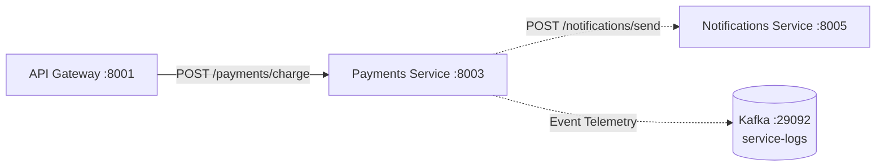

# Payments Service

The **Payments Service** processes customer payment authorizations and charges for the e-commerce platform. It handles card transactions, foreign exchange conversions, single-transaction spending limits, and payment receipt dispatches via the **Notifications** service.

---

## Architecture & Responsibilities



### Core Features
- **Payment Processing**: Authorizes and captures credit card charges for customer orders.
- **Foreign Exchange Conversion**: Converts transactions into base USD amounts using an in-memory exchange rate table.
- **Risk & Policy Controls**: Rejects transactions exceeding the single-charge limit ($5,000.00) or declined payment methods.
- **Asynchronous Receipt Generation**: Dispatches payment receipts via Notifications in a non-blocking background pattern.

---

## Configuration

The service is configured via environment variables:

| Variable | Type | Default | Description |
| :--- | :---: | :--- | :--- |
| `SERVICE_NAME` | String | `payments` | Service identifier for logging and trace context. |
| `PORT` | Integer | `8003` | HTTP server port. |
| `NOTIFICATIONS_SERVICE_URL` | String | `http://notifications:8005` | Notifications service base URL. |
| `KAFKA_BOOTSTRAP_SERVERS` | String | `localhost:9092` | Kafka broker address for event logging. |

---

## Currency Exchange Rates

The service supports currency conversions based on base USD:

| Currency | Rate to USD |
| :--- | :---: |
| `USD` | `1.00` |
| `EUR` | `0.92` |

---

## API Reference

### 1. Health Check
Checks if the payments service is running.

```http
GET /health
```

#### Response (`200 OK`)
```json
{
  "status": "ok",
  "service": "payments"
}
```

---

### 2. Charge Payment
Authorizes and captures payment for a given order.

```http
POST /payments/charge
Content-Type: application/json
```

#### Request Body
```json
{
  "user_id": "user-1001",
  "amount": 50.0,
  "currency": "USD",
  "order_id": "ord-7f9a12b3",
  "payment_method": "credit_card"
}
```

#### Request Parameters
- `user_id` *(string, required)*: Identifier of the customer.
- `amount` *(number, required, >= 0)*: Charge amount.
- `currency` *(string, optional, default: "USD")*: Currency code.
- `order_id` *(string, required)*: Associated order identifier.
- `payment_method` *(string, optional, default: "credit_card")*: Payment method.

#### Success Response (`200 OK`)
```json
{
  "transaction_id": "tx-8a2b3c4d",
  "user_id": "user-1001",
  "amount": 50.0,
  "usd_equivalent": 50.0,
  "currency": "USD",
  "order_id": "ord-7f9a12b3",
  "payment_method": "credit_card",
  "status": "CAPTURED"
}
```

#### Error Responses
- **`402 Payment Required` (`PAYMENT_DECLINED`)**:
  Returned when the issuing bank declines authorization (e.g. `payment_method: "card_declined"`):
  ```json
  {
    "detail": "Payment authorization declined by issuing bank: DO_NOT_HONOR"
  }
  ```
- **`402 Payment Required` (`TRANSACTION_LIMIT_EXCEEDED`)**:
  Returned when `amount > 5000.00`:
  ```json
  {
    "detail": "Transaction amount $6000.00 exceeds maximum single charge limit of $5000.00"
  }
  ```

---

### 3. Get Transaction Details
Retrieves a recorded transaction by its ID.

```http
GET /payments/{payment_id}
```

#### Success Response (`200 OK`)
```json
{
  "transaction_id": "tx-8a2b3c4d",
  "user_id": "user-1001",
  "amount": 50.0,
  "usd_equivalent": 50.0,
  "currency": "USD",
  "order_id": "ord-7f9a12b3",
  "payment_method": "credit_card",
  "status": "CAPTURED"
}
```

#### Error Response (`404 Not Found`)
```json
{
  "detail": "Transaction not found"
}
```

---

## Running Locally

### With Python
```powershell
pip install -r services/requirements.txt
uvicorn services.payments.main:app --host 0.0.0.0 --port 8003 --reload
```

### With Docker Compose
```powershell
docker compose up -d payments
```
